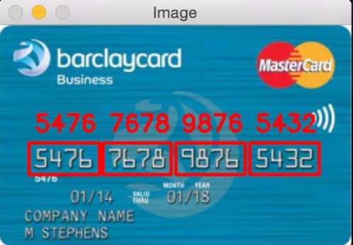

<h1> Credit Card Number Detection</h1>

> In this Project We are using This Feature to extract card number from live photo taken from user while registering. This Card number is manually verified with bank , our database  to register the user sucessfully.

 </img>

<h2> Description </h2>

* Used pytesseract module to Perform Optical Character Recognition.

* Windows users can install pytesseract.exe from <a href="https://pypi.org/project/pytesseract/"> documentation. </a>

* Linux Users can install using  these two commands

```
sudo apt install tesseract-ocr

sudo apt install libtesseract-dev

```

* For more Understanding Refer the python Notebook above.


<hr />


