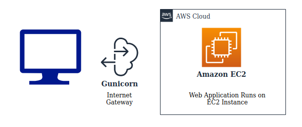

This website is built to serve multiple purposes. First and foremost purpose is to have a merchant website in order to show how the website redirects to the user's application. This website is also for promotional purpose where we have introduced an additional feature which is the Phishing Detection Feature. The user can visit our website and enter a URL in case he/she is skeptic about the website being genuine.

Flow Chart

Web Application runs 24 *7 on AWS EC2 Instance .

How this works?
Consider X has downloaded the Card Pay mobile application and has registered using his card details. After a few days, X's son plans to shop on a e-commerce website. While checking out, the card details are asked. If the son enters X's card details, the website is redirected to the Card Pay application of X. If X agrees with the shopping amount, he confirms the payment after which, the desired amount is added in the Virtual Debit Card and the payment is done. The son is happy.

Now imagine an unknown person trying to steal from this same card. Before the transaction takes place, X will get a notification and will be alerted about the happening. X can decline the payment and stay safe, or will try to reach out for help at leisure (because X knows he and his card are safe as long as he's using Card Pay).

We hope you found it insightful!
