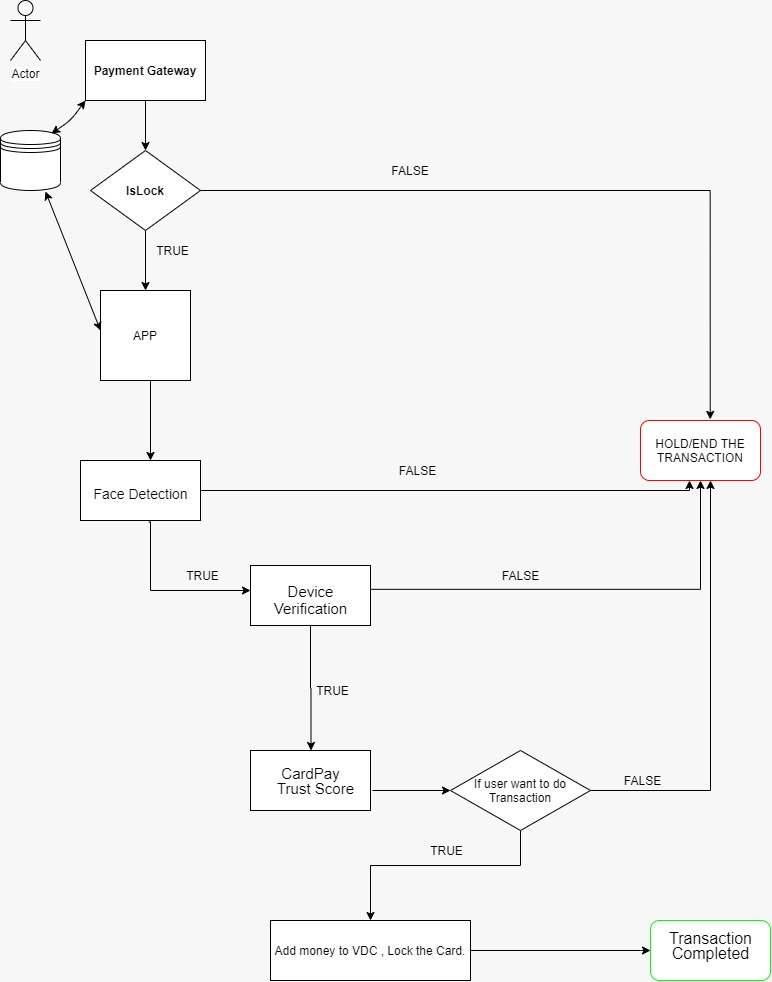

# IC472_CardPay

## Introduction
With the rapid advent in technology, there also have been cons that many face each day, falling prey to the lure of innovations and advancements. The same road has also led people towards automating everything they use, so as to lessen the burden and hard work involved in it. Like they say, with greater power, comes greater responsibilities. In our case, with greater automation, comes a greater consequence. Our project focuses on one such consequence, that we’ve all experienced at least once in our lives, a fraudulent bank transaction, or a fraudulent call trying to get to know important information from you for unimaginable and dangerous purposes. 

Let's have a look at the statistics from 2018.
> 

The below graph shows the consequences one goes through if they are a victim of credit card fraud transaction. 
> 

> *Any data is sensitive, if fallen into wrong hands, the effect and consequences can be disastrous. These frauds and malicious attacks call for a **ground-breaking** innovation which can help little by little to help everything fall into the right place. We believe that **Card Pay** holds the potential to make one feel safe and secure while enabling one to experience a seamless transaction.* 

## About Card Pay
Card Pay is a mobile application which Authenticates Users before transaction using AI Techniques, ensuring safety and security. How does this happen? Let's try to understand using the workflow below.

## Workflow
> 
